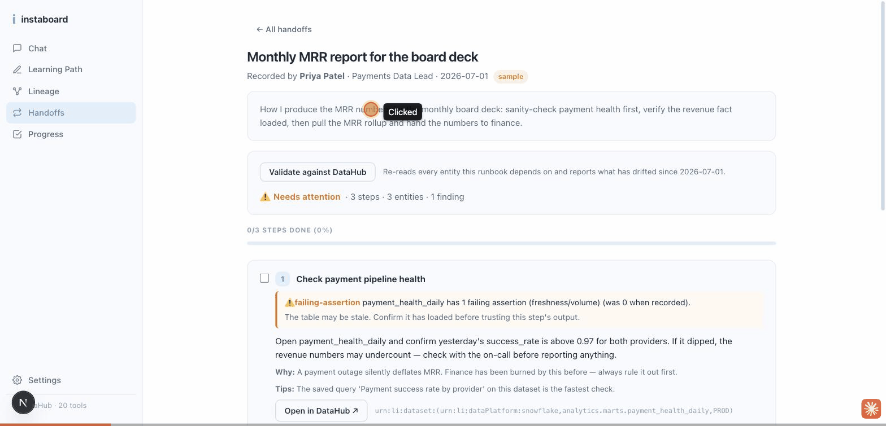

# instaboard

[](https://github.com/mcrowley19/Instaboard/actions/workflows/ci.yml)
[](https://github.com/mcrowley19/Instaboard/actions/workflows/prove.yml)

**Onboarding for data teams, built on DataHub.**

instaboard records how a team does a task and saves it as a step-by-step guide
in the catalog, then keeps checking that every step still matches what the
catalog holds. New hires ask it questions in chat and get answers off the live
catalog, with real table names and a URN you can paste into DataHub.

A guide names real columns, tables and owners, and all three keep changing
underneath it. When the catalog stops agreeing with a step, that becomes state
on the datasets involved: an assertion that fails, a warning tag, an incident
assigned to whoever owns the data now, and a proposed correction for a human to
approve. One naming note up front: guides were called runbooks in earlier
versions, so the tag written to DataHub is `Stale Runbook` and several scripts
and receipt files carry `runbook` in their paths.

| The moment | What instaboard does |
| --- | --- |
| A task gets recorded | Hit **● Record** in the side panel and do the task once. Every DataHub page you land on becomes a step, and your notes carry the why. |
| Nothing has been recorded yet | `npm run draft` writes a first pass from the queries, lineage and owners the catalog already holds, labelled `inferred` everywhere it shows up. |
| A column a guide's SQL reads gets renamed | The sweep names the step and the claim that broke, tags the datasets, and `npm run propose` derives the correction as a diff for a human to approve. |
| The owner a step says to ping has left | The incident lands on whoever owns the dataset today. |
| A new hire starts asking questions | Chat answers from the live catalog, with real table names and a URN you can paste into DataHub. |
| Someone repairs the guide | The incident resolves, the assertion goes back to passing, and the `Stale Runbook` tag comes off. |

[**Using it**](#using-it) walks through installing it and what you do on each of
the three surfaces. One command runs the whole thing end to end.

```bash
npm run prove
```

It starts DataHub if it isn't already up, ingests a sample catalog, records a
three-step *Monthly revenue close* guide and validates it clean. Then it breaks
the catalog for real, through DataHub's own write APIs. It **renames
`net_amount_usd` out from under step 2's SQL, deprecates `mrr_monthly`, and
takes Mike Rodriguez off `fct_revenue`**. Revalidation has to catch all three.
Afterwards the catalog is restored and the guide has to go green again.

**There are 39 assertions and the script exits non-zero if any of them fails.
The last run passed 39 of 39, on both catalogs.**

```bash
npm run prove                        # the catalog this repo seeds
npm run prove -- --catalog=showcase  # DataHub's own showcase-ecommerce datapack
npm run prove:repair                 # the correction, executed: real consumer SQL
                                     # breaks under the rename and comes back
                                     # byte-identical once repaired
```

```
4/7  validate — should be clean
    ✓ no drift reported — 1 runbook checked, 0 drifted
    ✓ every catalog claim holds — 16/17 claims hold
    ✓ the run reports how much of the runbook it could check — 2/3 steps validated,
      1 with catalog gaps (health)
    ✓ a clean run with unvalidatable claims is not reported as a pass —
      verdict INSUFFICIENT_DATA, 1/17 claims unvalidatable
5/7  break the catalog for real
    ✓ renamed net_amount_usd → net_revenue_usd on fct_revenue
    ✓ deprecated mrr_monthly
    ✓ removed Mike Rodriguez from fct_revenue
6/7  revalidate — should catch all of it
    ✓ the runbook is reported broken — 1 broken of 1
    ✓ broken claims moved the aspect they were pinned to — 3 of 17 broken, 13 still hold
    ✓ every incident on an owned dataset reaches its current owner —
      fct_revenue → urn:li:corpuser:priya.patel
    ✓ a correction is proposed for the renamed column — net_amount_usd→net_revenue_usd
    ✓ the Stale Runbook tag reads back off the dataset in DataHub — 2/2 carry it
7/7  restore the catalog and revalidate — should go green again
    ✓ every catalog claim holds — 16/17 claims hold
    ✓ the sweep itself closes the incidents it opened — 2 incident(s) resolved
    ✓ the Stale Runbook tag is retracted from every dataset it was applied to — 2/2 cleared
```

Two lines in there matter more than the rest. The clean runs don't report as
passes, because one claim on `mrr_monthly` can't be checked at all. Nothing in
the catalog is monitoring that table, so calling the guide green would mean
inventing evidence. The other line is the tag coming back off. It goes on when
the guide breaks and comes off when someone repairs it, with DataHub read back
on both sides so the write receipt isn't taken on trust.

The decay engine is told nothing about the breaking changes. It re-reads the
catalog and works out what happened for itself. Receipts for both runs:
[northbeam](examples/live/prove-loop-receipts.json),
[showcase-ecommerce](examples/live/prove-loop-receipts-showcase.json), walked
through in [`docs/loop-verification.md`](docs/loop-verification.md).

**You don't have to take those two files on trust.** A second workflow,
[`prove.yml`](.github/workflows/prove.yml), boots a real DataHub on a clean
Ubuntu runner every time anyone pushes, runs this loop against it on both
catalogs, and then diffs the receipts it just generated against the ones
committed here. Every check, verdict, coverage figure, tag read-back and
proposed edit has to match; only server-minted UUIDs and the run timestamps are
masked. The badge above says whether the last run reproduced them. Drift
detection has no model in it, so the workflow needs no API key and runs on pull
requests from forks too.

Every claim below has a row in [`EVIDENCE.md`](EVIDENCE.md), naming the artifact
that proves it and the command that re-derives that artifact. Most of them need
nothing beyond `npm install`.

Running it against DataHub's datapack turned up two things straight away: a
weakness in the rename detector, where a full token reorder from
`cost_of_delivery` to `delivery_cost_usd` scored 0.06 on edit distance and fell
below the threshold, and one assertion of our own that was too strict. Both are
fixed.



*Recorded against a live DataHub. One click re-validates a guide, flags the
failing freshness assertion on step 1, and writes the warning back to the
catalog.
[The note inside DataHub](docs/screenshots/stale-runbook-note-in-datahub.jpg) ·
[the failing assertion it detected](docs/screenshots/payment-health-failing-assertion.jpg) ·
[the incident and tag it raised](docs/screenshots/showcase-stale-runbook-tag-and-incident.jpg) ·
[dated receipts](docs/live-verification.md).*

---

## Using it

Node 22 runs the app. The live path also wants Docker and
[uv](https://docs.astral.sh/uv/getting-started/installation/), which is what
starts the DataHub MCP server and the seed script.

```bash
npm install
npm run datahub:up      # datahub docker quickstart, GMS :8080, UI :9002
npm run seed            # 14 datasets, 4 owners, glossary, lineage, saved SQL
npm run dev             # the app on :3000
```

Open `localhost:3000` and paste an LLM key into **Settings** in the left
sidebar. Underneath it a status pill says whether DataHub is answering and how
many tools came back. With no Docker to hand,
`echo "DEMO_MODE=true" > .env.local` before `npm run dev` swaps the catalog for
a built-in fixture, and everything below still works.

### Ask the catalog something

**Chat** is the page it opens on. Type a question, or click one of the five
starters. "What breaks if I change users.email?" sends the agent to `search`,
then `get_entities`, then `get_lineage`, and the tool trace above the answer
expands so you can read each call and what came back. Answers carry real table
names and a URN you can paste into DataHub.

Three more pages hang off the same sidebar. **Learning Path** takes a role and a
domain and builds a week-one plan out of live catalog exploration, leaving
deprecated tables out, then saves the plan back to DataHub. **Lineage** takes a
dataset name and explains what feeds it, what it would break, and who to warn.
**Progress** tracks how far through the plan someone has got.

### Record what somebody knows

Install the side panel: grab the zip behind **Download the extension** on the
landing page, or use the repo's `extension/` folder directly. Open
`chrome://extensions`, turn on Developer mode, hit **Load unpacked** and pick
the folder, then pin the icon and click it. Longer instructions are in
[`extension/README.md`](extension/README.md).

Open the DataHub page you would normally start from and hit **● Record** in the
panel header. Now do the task. Every page you land on is captured as a step
carrying its URL, title and entity URN, and **Add note** attaches the *why* to
whichever step you are on, which is the part no catalog holds. Hit **■ Stop**,
give the task a title and your name, and click **Generate guide & save to
DataHub**. The backend looks up every entity you touched, merges in your notes,
and writes the guide into the catalog with `save_document`.

`npm run draft -- --query=revenue` does a version of this with nobody recording
anything, working from the queries and lineage the catalog already holds. Then
whoever is leaving corrects a page that exists.

### Read a guide you inherited

Open **Handoffs** and pick one. Each step shows the action, the why, the real
SQL and the gotchas. *Open this page ↗* drives your DataHub tab to the right
entity, and a **You're on this page** marker confirms when the tab matches the
step. Progress is saved per handoff, so you can stop halfway and come back.

### Find out when it stops being true

On any handoff, click **Validate against DataHub**. It re-reads every entity the
guide depends on and reports what has moved since the day it was recorded,
one claim at a time. From a terminal, `npm run validate` runs the same sweep
over every stored guide and exits non-zero on a broken one, which is enough
for cron or a CI gate.

A broken guide then shows up inside DataHub, on the datasets involved: a
`Stale Runbook` tag, a failing assertion, structured properties naming the
change, and an incident assigned to whoever owns the dataset today. All of it
comes back off when the guide is repaired.

`npm run propose` derives the correction from the catalog and prints a unified
diff carrying the evidence behind each edit. `--apply` accepts it into the
guide store and `--pr` opens a pull request.
[Worked example](examples/proposals/monthly-revenue-close.md).

`npm run prove:repair` proves the correction by executing it. Real consumer SQL
from [`examples/consumer/`](examples/consumer/) first runs green against a small
warehouse whose schema is read out of the live catalog. After the drill renames
the column in DataHub, the readers fail with the missing column named in the
error. The approved correction is then applied to the workspace copy and every
query runs again. Passing requires each repaired query to return the exact
result hash it produced before the break. A wrong substitution would move the
hash, since the warehouse takes the rename as `ALTER TABLE … RENAME COLUMN` and
a rename cannot move the data underneath. Receipts land in
[`examples/live/prove-repair-receipts.json`](examples/live/prove-repair-receipts.json).

A guide's body of record is its Document in DataHub, and `npm run
reconcile` is how the two stay honest. It compares every stored guide
against its catalog document by content hash, three ways: the catalog now, the
local copy now, both as of the last sync. Edit the document inside DataHub and
the catalog wins; the next reconcile, or the next sweep, pulls your edit onto
the guide verbatim and nothing overwrites it. Corrections applied here reach
the catalog through a compare-and-set push that re-reads the digest first, and
a push that would land on top of somebody's DataHub edit is refused, including
the case where the edit was pulled but nobody folded it in yet. When both
sides moved, the conflict is named with both digests and left for a person.
`npm run prove:sync` walks that whole lifecycle against a live DataHub and
writes receipts to
[`examples/live/document-sync-receipts.json`](examples/live/document-sync-receipts.json).

More than one codebase reads a column like that, so `npm run campaign` turns
the same approved correction into one git patch per consumer repo, for the
plain SQL workspace and the dbt project alike. In dbt that means the model SQL
and the `sources.yml` documenting the column, together. Every patch is applied
to a pristine copy before anything ships, and the manifest records the result
next to the plan hash of the approval it rides on. Where a live catalog is
reachable, the manifest also carries the catalog's case for the blast radius:
saved queries that mention the old column, and what sits one hop downstream in
lineage. The committed patches under
[`examples/campaigns/`](examples/campaigns/) are re-derived byte-for-byte in CI
from the committed receipts and repos, then re-applied.

### Or click through it without installing anything

The hosted demo at [instaboard-mu.vercel.app](https://instaboard-mu.vercel.app)
replays a committed recording, so chat answers with no API key at all. The
validation panel there carries buttons that break the catalog, and the verdict
recomputes through `diffAgainstCatalog`, the same function the live sweep calls.

---

## How the loop works

Underneath that walkthrough are five stages, plus a zeroth one for catalogs
where nobody has recorded anything yet.

**0. Draft, before anyone records anything.** A year-old catalog already knows
the queries people ran, the lineage of what feeds what, who owns which table and
what has been failing. `npm run draft -- --query=revenue` reads all of that and
writes a first pass: a health check, the upstream checks, the recorded SQL, the
downstream blast radius. So the tool does something useful on day one in any
DataHub, and whoever records starts from a draft they can correct.

No catalog can tell you *why step 2 exists*. Drafted steps are marked
`inferred`, their reasons are written as evidence, and every surface that renders
one says **"Draft runbook — nobody recorded this"**. A draft that passed itself
off as a colleague's judgement would defeat the whole point of the project.
[Sample](examples/drafts/).

**1. Capture.** Whoever knows the task hits ● Record and does it in DataHub the
way they always do. Every page they land on becomes a step, and they type in the
*why*. The agent then fills each step out from the live catalog with owners, the
real recorded SQL, lineage and health, and writes the finished guide back
through `save_document`, linked to the datasets it touches. Five real ones sit in
[`examples/runbooks/`](examples/runbooks/).

**2. Pin.** Each step breaks down into **claims**: this dataset exists, it has a
column called `net_amount_usd`, Mike owns it. Every claim is pinned to a content
fingerprint of the exact catalog aspect that backed it. Fingerprints hash public
catalog facts, so anyone holding the guide and a DataHub connection can
recompute one and check the pin.

**3. Validate.** Read the catalog again and re-check every claim. What runs here
is a deterministic diff over schema and health, with **no LLM anywhere in it**,
so you can confirm any verdict in the DataHub UI in about ten seconds:

```
✓ step 2 · fct_revenue has a column `net_amount_usd`, which this step reads. — schema@89280579c9b0 (2026-07-01) → schema@89280579c9b0
✗ step 1 · payment_health_daily has no open incidents and no failing assertions. — health@6f3f70fb7154 (2026-07-01) → health@b3b7361fb1ae
```

The report says `18 of 19 claims still hold`. A reader learns from that the
guide is followable apart from one named thing, which is the kind of answer
somebody can act on.

It also says what it couldn't check. A verdict comes back as one of three things:

| | |
| --- | --- |
| `PASS` | every claim was checked, and every claim holds |
| `FINDING` | something concrete drifted, and here is the step and the fact |
| `INSUFFICIENT_DATA` | nothing drifted among the claims that could be checked, and some could not be checked at all |

The third one exists because a validator fails by going quiet. A step pointing at
a dataset with no assertions looks identical to a step whose checks are all
passing, and "no failing assertions" is a true sentence that means nothing when
nothing is asserting. The same goes for a dataset the catalog holds no schema
for. An empty field list used to read here as *every column the guide names has
been dropped*, which is about the loudest false positive available on the least
reliable input going. Both now come back as coverage gaps, reported per step and
naming the dimension:

```
2/3 steps validated, 1 with catalog gaps (health)
~ step 3 · mrr_monthly: it has no assertions or incidents, so nothing is monitoring it
```

That figure goes into DataHub as `instaboard.revalidationCoverage`, since a
coverage number nobody can see turns back into the thing it exists to prevent. On
DataHub's own `showcase-ecommerce` datapack the honest answer works out at **0/4
steps validated**. That catalog ships with no assertions and several unowned
tables, so none of the guide's steps are fully checkable, and the tool says so.

**4. Write it back as state.** The findings land in the catalog as things a
person will walk into:

- a **custom assertion** per (guide, dataset) that fails while the guide is
  stale and passes when it validates clean, carrying the specific catalog change
  and the provenance chain in its result properties;
- **structured properties** with the guide's status, the change that broke it,
  and every validated-against pin;
- a **`Stale Runbook` tag** on everything that drifted, plus an
  **`Unvalidated Runbook Step` tag** on anything the catalog held too little
  about to check. They stay separate because one of them asks you to fix the
  guide and the other asks you to fix the catalog entry;
- a real **Incident** on any dataset where a step would now fail, **assigned to
  whoever owns that dataset today**, who in the owner-drift case is the person
  the guide has never heard of.

Clean runs get written too, because a dataset that only ever hears from you when
something breaks leaves "fine" and "nobody checked" looking the same.

All of it comes back off again. When someone repairs the guide, the incident is
resolved, the assertion goes back to passing and the `Stale Runbook` tag is
removed. That last one is guarded, since the tag is shared: if a *different*
stored guide is still stale on that dataset the tag stays put, and the receipt
says whose it is. A detector that only ever adds state ends up as a catalog full
of warnings about problems fixed months ago, which nobody reads. The proof loop
asserts the retraction by reading DataHub back on both sides.

**5. Propose the fix.** `npm run propose` works the correction out from the
catalog, matching the renamed column against columns that have appeared since,
reading the replacement named in a deprecation note, looking up the current
owner. What comes out is a **unified diff for a human to approve**, carrying the
evidence behind every edit and an explicit list of what it refused to guess at.
`--apply` accepts it and `--pr` opens a pull request.
[Worked example](examples/proposals/monthly-revenue-close.md).

Nothing gets applied automatically, because a document whose whole value is that
a colleague vouched for it shouldn't be rewritten by a cron job.

**6. Prove the repair.** `npm run prove:repair` executes the approved correction
against real consumer SQL and passes only when every repaired query reproduces
its baseline result hash. The write-back from step 4 comes off in the same run:
the assertion returns to passing, the tag is retracted, and the incidents the
drill raised are resolved, with each of those facts read back out of GMS. The
receipt binds a plan hash over the approved edits to per-file artifact hashes
and to the catalog's own schema fingerprints at baseline, broken and restored.

`npm run validate` runs steps 3 to 5 over every stored guide and exits non-zero
on a broken one, so you can hang it off cron or use it as a CI gate.

---

## How well does the detector work, and where does it fail?

The proof loop breaks three things and catches three things, which is a
demonstration with N=1 per kind. It also only measures recall, so it says nothing
about how often the engine fires when nothing is wrong, and that second number is
what decides whether a team keeps it switched on.

```bash
npm run bench:drift              # plant, score, restore; needs a DataHub
npm run bench:drift -- --verify  # re-derive this table from the committed run
```

That plants known drifts across every stored guide, mixes in two kinds of
negative, validates blind and then scores two axes separately.

<!-- drift-table:start -->
| | Result |
| --- | --- |
| Planted drifts detected | **6/6** across 4 kinds |
| Controls that stayed quiet | **4/4** — column added, description edited, column description reworded, owner appended |
| Decoys that stayed quiet | **6/6** |
| Unexplained findings | **0** |
| Detection precision · recall · F1 | **100.0% · 100.0% · 100.0%** |
| Corrections derived for detected renames | **1/1** |
| Catalog changes restored afterwards | 16/16 |
<!-- drift-table:end -->

**The hard case.** `product_status` → `settled_value` is planted on every run
precisely because the name carries no signal: token overlap and edit distance
both score near zero, and a matcher that connected the two on their names would
be matching noise. Detection reports the column missing either way. The
correction comes from the structural rule instead, one column gone and one
arrived in the same slot, and is proposed at `medium` confidence with a
rationale that says which column replaced it while refusing to claim the two
mean the same thing. The case stays planted because a benchmark whose cases
were all chosen after the rule was written measures the rule against itself.

The two axes get scored separately because they fail in different ways. Spotting
the drift is a schema-and-health diff, and it holds up. Guessing what a column
was renamed to comes down to string similarity, which is much shakier, and
scoring the two together would let the sturdy half carry the shaky one.

[Full run](examples/live/drift-benchmark.json) ·
[scorecard](evals/results/drift-scorecard.md), which lists every negative case and
what it produced. `npm test` fails if the table above stops matching the committed
run, so it cannot drift from the artifact it came from.

Four things in the harness keep the numbers honest:

- **A baseline pass.** Findings that pre-date the injection are excluded from the
  false-positive count, so a guide that was already stale doesn't get blamed on
  the engine, and doesn't quietly pad its score either.
- **Independent ground truth.** Working out which columns a step depends on
  happens by tokenising its SQL. Asking the engine's own reference matcher would
  leave recall measuring the harness agreeing with itself.
- **Decoys on datasets that guides do read.** Two of the six drop a column
  from a table a guide uses, where no step mentions that column. The engine
  holds a snapshot of those entities and has to stay quiet anyway, which is a
  good deal harder than passing a decoy planted on some table nobody reads.
- **Controls that change what guides *do* read.** A column added, a description
  rewritten, a second owner appointed. Every one of those moves the aspect
  fingerprint a claim is pinned to, and none of them invalidates anything, so a
  detector that equates "the aspect changed" with "the guide broke" fires on
  all three. This is where a real catalog spends most of its time, and it's the
  negative worth having. A fourth control belongs on that list, "an assertion was
  added and passes", and isn't planted: `deleteAssertion` refuses the assertions
  `upsertCustomAssertion` creates
  ([filed](https://github.com/datahub-project/datahub/issues/18817)), so it could
  not be reversed, and every other change here is.

Recall is counted per planted drift and precision per finding, on purpose: one
drift legitimately produces several findings when two guides read the same
table, and both are right.

Running the benchmark paid off twice over straight away. `plan` → `plan_v2` came
back as a detected drift with no correction proposed, because one surviving token
out of two is a 0.5 overlap however obvious the pair looks, so the rule was
declining on every short column name. That is fixed and
[tested](tests/remediate.test.ts). The `settled_value` case above is the one that
remains, and it comes from the shape of the problem.

## Does grounding in DataHub help? Three arms, two catalogs.

`evals/` holds a 20-question onboarding benchmark, made of the questions a real
new hire asks in week 1, scored **deterministically** against the catalog. Every
check is a substring match on facts that live in DataHub, a case passes only
when every check in it passes, and nothing in the scoring involves an LLM judge.

The obvious two-arm design, with tools and without them, partly measures *having
tools* at all. So there's a third arm sitting in the middle: the same agent loop,
wired to the warehouse the way an engineer wires themselves up when there is no
catalog. It gets `information_schema` and nothing more, so table names, column
names and column types. It reads the same catalog stripped down to what a
database connection would hand back.

| Suite | Catalog | With DataHub | **Warehouse schema only** | No tools | Scorecard |
| --- | --- | --- | --- | --- | --- |
| `northbeam` | seeded by this repo, **read live** | **18.0 ± 1.7/20** | 8.7 ± 0.6/20 | 3.0 ± 1.0/20 | [scorecard.md](evals/results/scorecard.md) |
| `showcase` | **DataHub's own `showcase-ecommerce` datapack**, 1,065 entities we didn't author | **20/20** | 4/20 | 3/20 | [showcase-scorecard.md](evals/results/showcase-scorecard.md) |

The `northbeam` row comes from **three independent passes against a live
DataHub**, with the mean, the standard deviation and the full range published per
arm. What decides anything here is that the ranges don't touch. The grounded
arm's *worst* pass scored 16/20, the schema arm's *best* scored 9/20, and the
control's *best* scored 4/20. Thirteen of the sixty (case × arm) combinations
weren't unanimous across the three passes, and the scorecard names every one of
them.

The `showcase` row is still a single pass. Repeating it needs the free-model
daily cap to reset; `npm run eval -- --live --runs=3 --suite=showcase` resumes
from the cache and finishes it.

On DataHub's own catalog, warehouse introspection scores **one case above
answering from memory**. Effort wasn't the problem: it made 118 tool calls
against the grounded arm's 78 and still finished 16 cases behind. Listing every
table in the warehouse won't tell you which of six identically-named copies
people use, who to ask about it, or what the company means by "active user".

The third arm exists to isolate exactly that: **what closes the gap is the
metadata.**

```bash
npm run eval -- --live --runs=3            # Northbeam, live, three passes per case
npm run eval -- --live --suite=showcase    # DataHub's own catalog
npm run eval -- --live --runs=3 --models=a,b,c   # …and across several models
DEMO_MODE=true npm run eval                # no DataHub, no Docker
```

`--runs` and `--models` are what turn a score into a measurement. Answers are
cached per (model, catalog, arm, case, run), so a run that stops against a
provider's daily cap resumes where it left off, and no pass is ever reused as
another.

Every raw answer sits in the matching `latest.json`, and CI re-scores all three
arms from those answers on every push. Hallucination and health-trap cases also
have their full transcripts committed with the arms side by side, at
[`evals/results/transcripts/`](evals/results/transcripts/).

---

## What we haven't proven

Everything above came out of a real run. Below are the places where a reader
should discount us, written down here so nobody has to go and find them.

**The proof loop is a reproduction, and CI for it is new.** `npm run prove`
passed 39/39 repeatedly during development on both catalogs, on a macOS
laptop, against DataHub 1.5.0.6 from the OSS quickstart. It now runs in CI on
a clean Ubuntu runner as well, a second OS on a second machine with a fresh
quickstart and none of anyone's laptop state, and there it regenerates the
committed receipts from a fresh run before comparing them. That's the check
the badge reports, and the badge is young. Read it as "this reproduced on the
last push". It has never run on DataHub Cloud, on any other DataHub version,
or under a second operator.

**The drift benchmark is small, and doesn't cover every kind.** Six planted
drifts, six decoys and four controls will catch a broken detector. Putting a
confidence interval on 100% takes a great deal more than that. The last run
covered four of the five drift kinds, the planted semantic case among them. No
`owner-removed` drift got planted, because the planner only plants one when a
step names an owner whose username tokens show up in its prose, and none of the
stored guides happened to qualify. So the proof loop is what covers the owner
path, twice, on both catalogs. A control for an assertion added that passes is
missing for the reason given above. Both numbers come from one run on one
catalog family, so neither is a
distribution.

**Coverage is measured per dimension.** A step counts as validated when the
catalog holds schema, owners and at least one assertion for its dataset, which is
a proxy. A table with one stale freshness assertion and nothing else counts as
monitored, and a step whose real dependency is what a column *means* counts as
covered as long as the column still exists. Coverage tells you the catalog could
answer, and stays silent on whether the answer was worth much.

**The decay engine covers semantic drift only as far as the catalog documents
it.** It catches an entity that vanished, a referenced column that vanished, a
table deprecated since recording, health that has turned red, and an owner who
moved on. **Semantic drift**, where a column still exists and still loads but
now means something different, is checked through the column's documentation:
when the measurement terms in a referenced column's description change (units,
currency, inclusion and exclusion words, time grain, numbers), a
`semantic-drift` warning names the column and quotes its meaning before and
after. The benchmark plants one such change, beside a reworded description with
the same measurement terms that must stay silent. The dangerous remainder is
the redefinition nobody documents: an upstream filter change that leaves the
description untouched produces nothing, and a guide can still sit at 19/19
claims holding while being wrong in exactly that way. The comparison also needs
the description as it stood at record time, so only guides recorded since
column documentation entered the snapshot can be checked at all.

**Columns in SQL are read from the query's syntax tree; prose is still matched
as text.** A column named inside a string literal or a SQL comment no longer
counts as a dependency, and the parser reaches into subqueries. Its edges are
real: a statement it cannot read, and any `SELECT *`, falls back to the word
matcher, so a column reached through `*` or an alias stays invisible. Prose is
matched word for word, which is where a column called `date`, `plan` or
`status` can still collide with a sentence that has nothing to do with it.

**Rename detection runs on two weak signals and is still the weakest rule we
ship.** The first signal is the names: `0.75 × token overlap + 0.25 × edit
distance`, which treats "every content word survived" as strong, proposes above
0.55, and refuses when the top two candidates sit within 0.1 of each other. A
coincidentally similar name gets proposed just as readily as a real rename.

When the names say nothing, the rule looks at the shape of the change instead:
exactly one column left, exactly one arrived, and the one that arrived took the
index the old one occupied. `ALTER TABLE RENAME COLUMN` preserves ordinal
position while `ADD COLUMN` appends, so a column showing up *in place of* another
is evidence about which operation someone performed. Two departures, two
arrivals, an append, or a drop with no arrival all make it decline. Confidence
here is always `medium`, and the rationale spells out what the rule doesn't know,
which is whether the two columns mean the same thing. A drop plus an unrelated
addition that happened to land in the same slot would fool it.

The check that counts here is the human reading the diff.

This rule has been wrong three times, every one of them found by running it
against something we didn't hand-pick. The original weighting scored
`cost_of_delivery` → `delivery_cost_usd` at 0.49 and missed it on DataHub's own
datapack, because edit distance punishes reordering far harder than a reader
would. Then the drift benchmark caught `plan` → `plan_v2` at 0.52, where one
surviving token out of two is a 0.5 overlap however obvious the pair looks, so
the rule was declining on every short column name. Then came the benchmark's
adversarial plant, `product_status` → `settled_value`, which no name-based
matcher can solve and which we had written off as unsolvable. It was unsolvable
*by string matching*, and we had confused the two. All three are fixed, the
adversarial case is still planted on every run, and you should assume there are
more.

**A drafted guide is a starting point.** Everything in a draft comes from
catalog evidence, and no catalog holds the reason a step exists. Drafts are worth
having because correcting one costs far less than writing from nothing, though a
team that files drafts without correcting them has automated the production of
plausible documents and ends up worse off than having none, which is why the
labelling is deliberate and load-bearing.

**Owner matching can collide.** Owners are matched by normalised substring, so
two people whose display names share a substring could be confused. We haven't
hit it on a real catalog; a large org with common surnames would.

**Benchmark numbers are one model.** All of it is
`nvidia/nemotron-3-ultra-550b-a55b:free`. The `northbeam` suite is now three
independent passes against a live catalog, so variance *across re-runs* is
measured and published, with the mean, the standard deviation, the full range and
every case whose outcome wasn't unanimous. Variance **across models** is missing.
The second model in a three-model run hit the provider's 1,000/day free-model cap
partway through, and a capped run produces near-zeros that look like a model
failing. We stopped that run and left it unpublished, and the cap now registers
as terminal so nothing retries into it. The cache holds every completed pass, so
`--models=…` resumes after the reset. `showcase` is still one pass.

A frontier model is untested and unaffordable here, and it's the most likely
thing to compress this gap: a stronger model answers more of these from
parametric knowledge alone, which lifts the control arm. Read the delta as
measured on this model.

Cases are cached so a run can resume, which means a published score may have been
assembled across sessions, always on one model and one catalog, never mixed. The
cache key carries model, catalog mode, arm, case and run index precisely so that
cannot happen silently. It could before: the key was `(model, arm, case)`, so a
`--live` run and a fixture run of the same suite shared entries. Six showcase
cases hit free-tier HTTP failures on the first pass and were retried until they
returned an answer. That is retrying transport, and it is still a retry policy
you should know exists.

**Scale is measured on one axis only.** `npm run bench:scale` grows
a real DataHub to N datasets, sweeps it, and tears the synthetics down again. Run
against 91, 1,091 and 5,091 datasets, a 56× range, the sweep made **the same
number of catalog reads at every size** (25 over GraphQL, 27 over MCP, since the
two transports ask one health question differently) and spent **zero LLM
tokens**, which the benchmark earns by refusing to start if `LLM_API_KEY` is set.
That's the load-bearing claim and it is exact: the sweep reads the entities the
guides name, so its cost is a property of how many guides you have, and how
big your catalog is doesn't come into it.

**The timing column is missing on purpose.** Wall-clock proved noisier than
the effect: the identical sweep over the identical 91-dataset catalog measured
50.1s and 107.1s minutes apart. Repeats brought that under control, but the
benchmark's own load did not. After ~40,000 document writes and deletes in an
afternoon, per-entity reads on this laptop degraded from ~1s to 12.5s and
stayed there across a GMS restart. Numbers taken in that state measure a tired
OpenSearch, so there is no `scale-scorecard.md` committed. `npm run
bench:scale:verify` reports the absence without failing. The harness is here,
and a clean box would take twenty minutes to produce the table.

**A 10,000-dataset sweep has not completed.** At that size,
`mcp-server-datahub` stopped responding entirely. A `get_entities` call that
GraphQL answered in 4.5s hung past 295s with both the subprocess and DataHub idle
at 0% CPU. Nothing in this repo bounded that wait, so an unattended nightly sweep
would have hung indefinitely and never raised an error; `callDataHubTool` now
carries a 120s deadline because of it. Whether the hang is load, catalog size, or
something else in that client is not established.

**And 100,000 is still a guess.** The sweep is serial per guide, and the
structured-property merge reads before it writes, which would get expensive.
Nothing above extrapolates there.

**DataHub was not the source of truth for a guide's text, and now it can be.**
`get_entities` on a document URN returns the URN and nothing else, so the body
lived in local storage and DataHub held a copy nobody could verify. That turned
out not to be a DataHub limitation at all: GMS returns
`Document.info.contents.text` in full over GraphQL, on the same server, in the
same query. The MCP server strips the entire `... on Document` selection because
it is `#[NEWER_GMS]`-tagged and those fields are enabled only for DataHub Cloud.
So documents are read back over GraphQL, the way incidents already were, and
every document write now carries a round-trip receipt with the written digest,
the read digest, and whether they agree. A body DataHub will not serve is
recorded as a failed read and never as an empty document.
[The original probe](submission/oss/issues/07-documents-cannot-be-read-back-by-urn.md)
and [the upstream fix](https://github.com/acryldata/mcp-server-datahub/pull/178),
with a regression test.

What is still true: the local copy remains the working store, and the receipt is
what tells you the two agree, in place of an architecture that would make
divergence impossible.

**The write-back has no permissions model.** It uses whatever token you
configure. RBAC goes unexamined, the sweep records nothing about who triggered
it, and two sweeps can run at once over the same guide with nothing to stop
them.

**Custom assertions can't be cleaned up.** `deleteAssertion` refuses the CUSTOM
assertions that `upsertCustomAssertion` creates
([filed upstream](https://github.com/datahub-project/datahub/issues/18817)), so
deleting a guide leaves its assertion behind on the dataset until someone
removes it with the CLI.

**The Chrome extension is unit-tested and not browser-tested.** Entity detection
is tested against URLs captured from a running DataHub, and there is one real
end-to-end [capture](examples/live/extension-receipt.json). The panel itself is
exercised by hand. We shipped a detection bug that no test caught because no test
drove a real browser, which is the upstream issue below.

## How this differs from agent memory

Institutional memory is a crowded idea and two different things get called by
that name. One of them is **recall**, an agent that remembers what it learned
about a catalog so the next session starts warmer.
[`datahub-memory`](https://github.com/datahub-project/datahub-skills/pull/69) does
that, and it is a separate problem from this one. instaboard captures what a
*person* knew as a guide that a human wrote and vouched for, then re-checks it
deterministically against the catalog and reports which specific claim stopped
being true. The half that matters here is the revalidation, so the claims, the
pins, the coverage, the write-back and the retraction, and none of it depends on
an agent remembering anything.

## When you shouldn't use this

- **Your guides aren't about catalogued data.** The whole mechanism is
  re-checking claims against a catalog. A guide about a deploy process has no
  claims this can verify.
- **Your catalog is thin.** If datasets have no owners, no glossary terms and no
  health signals, there is little for a claim to be pinned to, and the benchmark
  above says most of the value was in exactly that metadata.
- **You need semantic correctness.** See above. This proves a guide is still
  *executable*, and says nothing about whether it is still *right*.
- **You want fully automatic remediation.** By design it stops at a proposal.

---

## Contributing back upstream

Eight contributions came out of building this, seven filed and one written up
below. Write-ups stay in [`submission/oss/`](submission/oss/) so the
reproductions are readable here too.

| What | Where |
| --- | --- |
| **`datahub-onboarding` skill**, the onboarding, capture and validation workflow generalised into a registry skill, with a `/catalog-onboarding` command, three evaluation cases and the router registration | [datahub-skills#79](https://github.com/datahub-project/datahub-skills/pull/79) |
| ↳ follow-up: claim-level provenance, write-back as catalog state, and catalog-derived corrections | [same PR](https://github.com/datahub-project/datahub-skills/pull/79#issuecomment-5159658074) |
| ↳ second follow-up: the three-state verdict, coverage tracking, and retracting the tag on repair, written and ready to push | [`submission/oss/`](submission/oss/PR_INSTRUCTIONS.md) |
| **A document written with `save_document` cannot be read back by its URN.** `get_entities` returns only the URN, `search_documents` returns metadata without content, and `grep_documents` repeats the same excerpt once per match position, so an agent cannot read its own writes | [write-up with a live repro](submission/oss/issues/07-documents-cannot-be-read-back-by-urn.md) |
| Nothing in the 20-tool MCP surface returns usage, and `get_entities` doesn't inline it, so an agent cannot rank six lookalike tables by query volume | [mcp-server-datahub#171](https://github.com/acryldata/mcp-server-datahub/issues/171) |
| `get_entities` on an incident URN errors, and health reports `causes: ["ACTIVE_INCIDENTS"]` where the assertions branch of the same field returns URNs | [mcp-server-datahub#172](https://github.com/acryldata/mcp-server-datahub/issues/172) |
| Two tool schemas use multi-type `anyOf` unions that make OpenAI-compatible providers 422 the whole tool list | [mcp-server-datahub#173](https://github.com/acryldata/mcp-server-datahub/issues/173) |
| **`get_entities` stops returning entirely on a ~10k-dataset catalog.** No response after 295s with the client, the server and every container idle at 0% CPU, while GMS answered the equivalent GraphQL query in 26ms. No client-side timeout, so an unattended sweep hangs and never raises an error | [mcp-server-datahub#179](https://github.com/acryldata/mcp-server-datahub/issues/179) |
| `showcase-ecommerce` silently loses 248 MCPs on OSS, every usage and assertion aspect among them, and still reports success | [datahub#18815](https://github.com/datahub-project/datahub/issues/18815) |
| `deleteAssertion` rejects CUSTOM assertions that `upsertCustomAssertion` created two calls earlier; only the CLI can remove them | [datahub#18817](https://github.com/datahub-project/datahub/issues/18817) |
| **No supported way for a browser integration to know which entity a DataHub page is showing**, with a reference implementation and 16 test vectors | [datahub#18818](https://github.com/datahub-project/datahub/issues/18818) |

The last one is the reusable one. DataHub serves a `dataFlow` at `/pipelines/`
and a `dataJob` at `/tasks/`. Eleven of its 31 routes don't match their entity
type name, five are a different word entirely, the mapping is published nowhere,
and nothing on the page states which entity you are looking at. We shipped the
obvious-and-wrong version of this and never noticed, because "no entity detected"
looks identical to "not a DataHub page"; we found it by pulling the route table
out of the frontend bundle to check. The fix, the route table read off a running
DataHub, and the vectors all sit in
[`submission/oss/entity-detection/`](submission/oss/entity-detection/) under MIT,
and a test fails the build if our copy and the published copy drift apart.

One more thing we hit was already filed: the `datapack --help` crash
([datahub#18497](https://github.com/datahub-project/datahub/issues/18497)) got a
[comment confirming it still reproduces on 1.6.0.17](https://github.com/datahub-project/datahub/issues/18497#issuecomment-5159253562),
so no duplicate went in.

Three of them changed this codebase.
[#172](https://github.com/acryldata/mcp-server-datahub/issues/172) is why
`lib/datahub-graphql.ts` exists, and why `discountSelfWrittenState` in
`lib/decay.ts` has to stop the sweep reading its own incidents and assertions
back as drift. The document read-back gap is why a guide's body lives in local
storage with DataHub holding the shared copy, which is the opposite of the
arrangement we wanted, and it is named in *What we haven't proven*.

---

## Setup detail

Everything above was produced against a real DataHub, and `npm run prove` after
`npm run seed` walks the whole loop in one go.

**Prerequisites.** Node 22, Docker, and
[uv](https://docs.astral.sh/uv/getting-started/installation/)
(`curl -LsSf https://astral.sh/uv/install.sh | sh`), which runs the DataHub MCP
server and the seed script. The first `datahub:up` pulls several images.

**The seeded catalog** is **Northbeam**, a fictional subscription-commerce
company: 14 datasets across postgres and snowflake with full schemas and docs, 4
owners, 3 domains, PII/Tier1/Finance tags, a metrics glossary, lineage across 4
pipelines, 5 saved SQL queries, and a deliberately failing freshness assertion.
Verify at [localhost:9002](http://localhost:9002) (`datahub` / `datahub`).

**Config.** `cp .env.example .env.local`. The defaults match a local quickstart.
Set `DATAHUB_GMS_TOKEN` if your DataHub requires auth.

**LLM key.** Paste one into **Settings** in the app, where it lives in browser
localStorage and is forwarded to your own server per request, or set
`LLM_PROVIDER` / `LLM_API_KEY` in `.env.local`. Nothing is hardcoded or
committed. The benchmark runs on a free tier:

```bash
LLM_PROVIDER=openrouter  LLM_MODEL=nvidia/nemotron-3-ultra-550b-a55b:free
LLM_PROVIDER=gemini      LLM_MODEL=gemini-2.5-flash
```

**Chrome side panel.** [Install instructions](extension/README.md). It follows
you inside DataHub, detects the entity on screen, and records guides. One real
capture against a live catalog is committed at
[`examples/live/extension-receipt.json`](examples/live/extension-receipt.json).

### Without Docker

```bash
npm install && echo "DEMO_MODE=true" > .env.local && npm run dev
```

Demo mode answers every DataHub tool call from a fixture of the same Northbeam
catalog, and the hosted demo at
[instaboard-mu.vercel.app](https://instaboard-mu.vercel.app) replays a committed
recording of a real session, so chat works with **no API key at all**. Replayed
answers are labelled *recorded session*.

**You can break the catalog yourself there.** The validation panel on the hosted
page carries buttons that drop the column step 2's SQL selects, deprecate the
table step 3 routes you to, or move the owner step 2 tells you to page, and the
verdict recomputes. None of it is scripted. The buttons mutate a copy of the
fixture snapshots, and the result comes back out of `diffAgainstCatalog`, the
same function the live sweep calls, with no demo branch inside the engine. It
runs the untouched catalog first, so the clean state you're comparing against is
one you watched it produce. Writing back is the part it can't do, since
incidents, assertions and tags need a real DataHub, and those receipts are
committed under `examples/live/`.

It's a fixture, so treat it as a tour. Two of its 7 tools
(`get_dataset_health`, `get_usage_stats`) have no equivalent on the real 20-tool
server, since DataHub inlines `health` and `deprecation` on `get_entities` and
exposes nothing at all for usage, so a demo tool trace shows you two calls that
never happen live. Every number in this README came from a live run. The
write-back refuses to run in demo mode even when a real GMS is reachable, so a
tour can't put fixture-derived claims onto anyone's datasets.

---

## Also in the box

The walkthrough above covers the surfaces a new hire touches. Two more
behaviours run underneath all of them:

- **Health and deprecation guardrails** that read `health` and `deprecation`
  before recommending a table, then lead with the safe alternative
- **Documentation gap write-back**, which drafts a missing description from
  schema and lineage and files it as a `DescriptionProposal` for an owner to
  review

## Scripts

| Script | Purpose |
| --- | --- |
| `npm run prove` | **the whole loop end to end, 39 assertions** (`-- --catalog=showcase` for DataHub's datapack) |
| `npm run prove:repair` | **the executed repair**: consumer SQL breaks under a live catalog rename and comes back byte-identical (`-- --catalog=showcase` works here too) |
| `npm run campaign` | fan the approved correction out as git patches across every consumer repo, dbt included, each verified by applying it |
| `npm run reconcile` | reconcile every guide against its DataHub document by content hash; catalog edits win (`--push` for local changes) |
| `npm run prove:sync` | **the body of record, proved**: a DataHub edit wins, a conflicting push is refused, the steward's words survive |
| `npm run prove:verify` | check the receipts that run just wrote against the committed ones; CI runs this (`--repair` for the repair receipts) |
| `npm run draft` | draft guides from catalog evidence with nobody recording anything (`--query=`, `--urn=`, `--save`) |
| `npm run bench:drift` | plant known drift, decoys and controls; score detection and correction |
| `npm run bench:verify` | re-derive the published drift table from the committed run; CI runs this |
| `npm run validate` | sweep every guide for decay; write notes, assertions, properties, incidents and tags back |
| `npm run propose` | derive corrections as reviewable diffs (`--apply`, `--pr`) |
| `npm run examples` | export stored guides to `examples/runbooks/` |
| `npm test` | vitest suite (346 tests, MCP and GMS mocked) |
| `npm run eval` | the 20-case benchmark, all three arms (`-- --suite=showcase`) |
| `npm run eval:verify` | re-score the committed answers for both suites; CI runs this |
| `npm run showcase:drill` | `record` / `break` / `receipts` / `restore` on DataHub's own datapack |
| `npm run dev` / `build` / `start` | the app |
| `npm run seed` · `datahub:up` · `datahub:down` | the local catalog and stack |

## Architecture

```
┌──────────────────────────────┐   ┌────────────────────────────────┐
│  Next.js UI (light, streamed)│   │  Chrome extension (side panel) │
│  chat · path · lineage ·     │   │  context capture on DataHub ·  │
│  handoffs · progress         │   │  record / replay · same chat   │
└──────────────┬───────────────┘   └───────────────┬────────────────┘
               │ fetch (NDJSON event stream)       │ fetch + {message, context}
┌──────────────▼───────────────────────────────────▼───────┐
│  API routes (app/api/*)                                  │
│  /chat · /learning-path · /lineage · /handoffs ·          │
│  /handoffs/[id]/verify · /save-document · /health         │
│  ┌────────────────────────┐  ┌─────────────────────────┐ │
│  │ Agent loop (lib/agent) │  │ Decay engine (lib/decay)│ │
│  │ LLM ⇄ tools until done │  │ deterministic diff      │ │
│  └───┬────────────────────┘  └───────────┬─────────────┘ │
│  LLM providers (retry/backoff)   MCP client (singleton)   │
└──────────────────────┼───────────────────────────────────┘
                       │ spawns: uvx mcp-server-datahub
            ┌──────────▼──────────┐
            │  DataHub MCP Server │  search · get_entities · get_lineage ·
            └──────────┬──────────┘  get_dataset_queries · save_document …
                       │ GraphQL/REST
            ┌──────────▼──────────┐
            │  DataHub GMS :8080  │
            └─────────────────────┘
```

- **The decay engine has no LLM in it, deliberately.** It diffs the schema and
  reads health against fingerprints captured at record time, so you can check any
  finding by hand.
- The MCP server is spawned once per process with `TOOLS_IS_MUTATION_ENABLED=true`
  so write-back works. Incidents, assertions and structured properties go over
  GraphQL, because the MCP server has no tools for them.
- The agent loop hands the LLM the **live** MCP tool list and streams
  `tool_call` / `tool_result` / `text` events. The benchmark's three arms all run
  through it.

## Project layout

```
EVIDENCE.md     one row per claim: the artifact, and the command that re-derives it
app/            page.tsx (landing) · (app)/ signed-in pages · api/ routes
components/     Sidebar, ToolTrace, Markdown, SettingsModal
                DriftPlayground.tsx (break the catalog from the browser)
lib/            mcp.ts (MCP client) · agent.ts (loop) · decay.ts (validation)
                provenance.ts (claims, fingerprints, pins, coverage) · remediate.ts (corrections + diff)
                sweep.ts (the unattended pass) · native-writeback.ts (incidents, tags, retraction)
                structured-state.ts (assertions + structured properties)
                draft-runbook.ts (drafting from evidence) · drift-injection.ts (the drift benchmark)
                drift-scorecard.ts (the published table, re-derivable offline)
                warehouse-introspection.ts (the eval's third arm)
                datahub-graphql.ts (what MCP has no tool for) · gms-aspects.ts (drill writes)
                replay.ts (zero-key demo) · demo-drift.ts (the interactive demo)
                providers.ts · prompts.ts · demo-*.ts
evals/          benchmark.ts + benchmark-showcase.ts (20 cases each) · suites.ts
                score.ts · run.ts · verify.ts · transcripts.ts · results/
extension/      Chrome side panel · entity-from-url.js (the detection contract)
scripts/        prove-loop.ts (the one-command proof) · prove-repair.ts (the
                executed repair) · repair-campaign.ts (mergeable patches per
                consumer repo) · drift-benchmark.ts
                draft-runbooks.ts · seed_datahub.py · showcase-drill.ts
                validate-runbooks.ts · propose-fixes.ts · export-examples.ts
                capture-replay.ts · live-receipts.ts
examples/       runbooks/ (five real ones + validation reports) · drafts/ · proposals/
                consumer/ (the SQL and dbt repos the drills break and fix)
                campaigns/ (verified-mergeable patches, one per repo)
                live/ (dated receipts from live runs, both catalogs)
submission/oss/ the upstream skill PR, the friction reports, the entity-detection package
tests/          vitest suite (346 tests)
```

## Security notes

- `.env*`, `*.key` and `credentials.json` are gitignored; the repo ships only
  `.env.example` with placeholders.
- API keys pasted in the UI live in browser localStorage and are forwarded as
  request headers to *your own* Next.js server only. Nothing is sent anywhere
  else.
- Write-back requires a DataHub token with mutation rights. See the limitations
  above: there is no permissions model beyond whatever that token can do.

## Troubleshooting

- **Sidebar says "DataHub offline".** GMS isn't reachable. Check `docker ps`,
  then `curl http://localhost:8080/health`. The status pill polls every 30s.
- **"No LLM configured".** Add a key in Settings or `.env.local`.
- **`npm run eval` exits immediately.** It needs `LLM_PROVIDER` and
  `LLM_API_KEY` in `.env.local`; the UI's localStorage key isn't visible to the
  CLI.
- **`npm run prove` fails at phase 1.** Docker isn't running, or the quickstart
  is still starting. Pass `--skip-quickstart` once GMS answers.
- **First MCP call is slow.** `uvx` resolves `mcp-server-datahub` on first use.

## License

[Apache 2.0](LICENSE).
