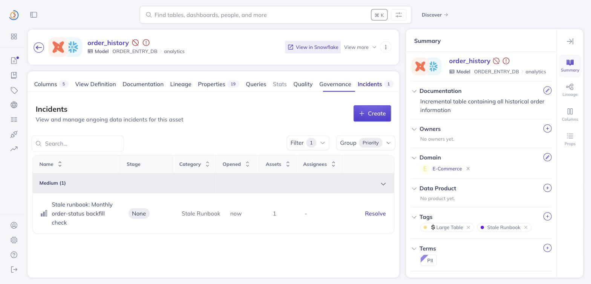

# Verified against DataHub's own catalog, 2026-08-02

instaboard first proved everything on **Northbeam**, which this repo seeds. That is worth
being sceptical about. When you own the catalog, the questions and the checks, a good score
is partly built in.

So both headline claims were run again against **`showcase-ecommerce`**, the demo datapack
DataHub publishes. It holds 1,065 entities spread over Snowflake, dbt, Postgres, S3,
Looker, PowerBI and Tableau. The DataHub team wrote all of it. One command loads it.

```bash
npm run datahub:up
datahub datapack load showcase-ecommerce
```

It also makes for a harder test than our own catalog. It loads alongside Northbeam, so the
agent is searching a warehouse with real collisions in it: two `orders` tables, six
datasets called some form of `order_details`, `customers` in four platforms, and an
`ORDER_DETAILS_REPLICA` whose 55 columns match the real table byte for byte.

---

## 1. The benchmark, on a catalog we didn't write

```bash
npm run eval -- --live --suite=showcase
```

| | Cases passed | Checks passed |
| --- | --- | --- |
| **With DataHub (MCP)** | **20/20** | 39/39 |
| Without DataHub (control) | 3/20 | 22/39 |

Full scorecard: [`evals/results/showcase-scorecard.md`](../evals/results/showcase-scorecard.md).
Every raw answer sits in [`showcase-latest.json`](../evals/results/showcase-latest.json).
`npm run eval:verify` re-scores both suites from those committed answers, and CI runs it on
every push.

The 20 questions check facts nobody here authored. That `ORDER_DETAILS` has David Kim and
Julia Novak as its data stewards. That its escalation contact is Ian Chen (`EMP006`), which
lives in a structured property rather than the ownership list. That it is kept for a year,
charged to Marketing, sits in the `Ecommerce Operations` domain and falls inside SOC 2
scope. That the glossary defines `Order Total` as `SUM(order_total)`. That
`shipment_tracking` does not exist, however plausible it sounds for an e-commerce
warehouse.

**Two categories were swapped out, and it is worth saying why.** The datapack keeps its
usage stats and assertion rollups in aspects that only exist in DataHub Cloud
(`usageFeatures`, `assertionsSummary`, `lineageFeatures`). Load it into an OSS quickstart
and 248 of its 3,809 MCPs get dropped on the floor. There is no query volume on an OSS
server to ground a question in, and inventing some would defeat the point. So `usage` and
`health-trap` give way to `authority` (working out which of six same-named copies is the
real one) and `governance` (retention, PII classification, SOC 2 scope, cost centre, all
read from structured properties the pack does carry). The silent drop is
[reported upstream](../submission/oss/issues/04-showcase-datapack-drops-cloud-only-aspects.md).

---

## 2. The decay loop, against real breaking changes

The decay engine is the novel piece. A demo where the author planted the failure proves
very little about it. So the drill records runbooks against the official datapack and then
breaks that catalog for real, through DataHub's own write APIs.

```bash
npm run showcase:drill receipts     # the whole cycle, captured
npm run showcase:drill restore      # put the catalog back
```

Receipts: [`examples/live/showcase-decay-receipts.json`](../examples/live/showcase-decay-receipts.json).

### What was recorded

Three runbooks on real showcase entities. Each one snapshotted through `snapshotHandoff`,
the same call the app makes when somebody stops recording, so the baseline is whatever
live DataHub handed back.

| Runbook | Steps | Entities |
| --- | --- | --- |
| Weekly order revenue pack for the commercial review | 3 | `ORDER_DETAILS`, `ORDER_ITEMS` |
| Monthly order-status backfill check | 2 | `ORDER_HISTORY`, `ORDER_DETAILS` |
| Promotion margin review before a campaign launch | 2 | `PROMOTIONS`, dbt `products` |

Sweep on the clean catalog: **3 checked, 0 with drift, 0 broken.**

### What was then broken

Three changes of the kind a real migration makes. The decay engine was told nothing about
any of them.

| Change | How | Which runbook it breaks |
| --- | --- | --- |
| Dropped `cost_of_delivery` from `ORDER_DETAILS` | rewrote the `schemaMetadata` aspect over the OpenAPI v3 entity endpoint | the weekly revenue pack sums it in step 2 |
| Deprecated `ORDER_HISTORY` | `updateDeprecation` mutation, with a note naming the replacement | step 1 of the backfill check queries it |
| Removed Priya Sharma as Data Steward on dbt `products` | the MCP server's own `remove_owners` tool | step 2 says to get her sign-off below `min_price` |

### What the sweep found

**3 checked, 3 with drift, 2 broken.** `npm run validate` exits 2.

| Runbook | Verdict | Finding |
| --- | --- | --- |
| Weekly order revenue pack | 🛑 broken | `column-missing`: "Column `cost_of_delivery` is referenced by this step but no longer exists on ORDER_DETAILS." |
| Monthly order-status backfill | 🛑 broken | `newly-deprecated`: "ORDER_HISTORY has been deprecated since this runbook was written." |
| Promotion margin review | ⚠️ warning | `owner-changed`: "This step says to contact Priya Sharma, who no longer owns products." |

One finding per runbook, each traceable to exactly one change. Nothing fired on the other
seven entities or the 43 columns that stayed put.

---

## 3. Written back into DataHub's native primitives

A drift note in a Document is real contribution to the graph, and it sits there until
somebody opens it. Findings that mean *"following this runbook now gives you a wrong
answer"* belong where a data team is already looking:

- **A native Incident** on the affected dataset, raised only for `broken` findings, typed
  from what went wrong (`DATA_SCHEMA` for a vanished column, `FRESHNESS` for a failing
  assertion, a custom `Stale runbook` type otherwise), linked back to the drift note.
- **A `Stale Runbook` tag** on every dataset that drifted, which turns "which of our tables
  have runbooks that have rotted?" into a search query.

Both are idempotent. A nightly sweep re-uses the incident it opened last night.



*`ORDER_HISTORY` in the real DataHub UI after one sweep. The deprecation badge and health
warning sit next to the name. The incident **"Stale runbook: Monthly order-status backfill
check"** is filed under a `Stale Runbook` category. The tag is in the sidebar. Also:
[the incident raised on `ORDER_DETAILS`](screenshots/showcase-incident-in-datahub.jpg).*

Incidents are the one thing the MCP server has no tool for, so that write drops to
DataHub's GraphQL API (`lib/datahub-graphql.ts`). Reading them back is worse. Pass an
incident URN to `get_entities` and you get "exists but no data could be retrieved", while
the entity's health summary reports `causes: ["ACTIVE_INCIDENTS"]` where the assertions
branch of the same field returns URNs. Both are
[reported upstream](../submission/oss/issues/02-incidents-unreadable.md). The workaround
lives in `discountSelfRaisedIncidents` in `lib/decay.ts`, which exists so tonight's sweep
doesn't read last night's incident as fresh drift and flag the tool to itself forever.

---

## Reproducing all of it

```bash
npm run datahub:up                        # DataHub quickstart
datahub datapack load showcase-ecommerce  # DataHub's own demo pack
npm run seed                              # Northbeam, for the other suite

npm run eval -- --live --suite=showcase   # 20/20 vs 3/20
npm run showcase:drill receipts           # record, sweep, break, sweep
npm run showcase:drill restore            # undo everything, incidents included
```

`restore` puts the column back, un-deprecates the table, restores the owner, resolves the
incidents the sweep raised and strips the tags it applied. Run the drill as many times as
you like from a clean catalog.
